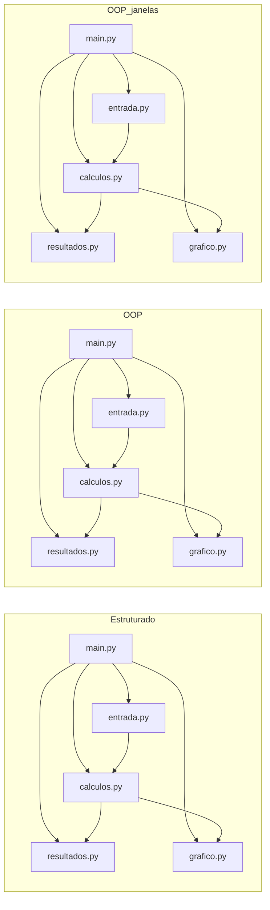

<div align="center">

# 🧮 Calculadora de Bhaskara

### Três implementações para resolver e visualizar equações do 2º grau

[](https://www.python.org/)
[](https://matplotlib.org/)
[](https://docs.python.org/3/library/tkinter.html)
[](#-contexto)

</div>

Projeto desenvolvido na disciplina de **Técnicas de Programação** do IFMA Monte Castelo. O repositório apresenta o mesmo problema em três abordagens: programação estruturada, orientação a objetos e orientação a objetos com janela gráfica.

## 📖 Sumário

- [✨ Sobre o projeto](#-sobre-o-projeto)
- [📊 Comparação das versões](#-comparação-das-versões)
- [🔄 Fluxo do projeto](#-fluxo-do-projeto)
- [⚙️ Requisitos](#️-requisitos)
- [▶️ Como executar](#️-como-executar)
- [📁 Estrutura de pastas](#-estrutura-de-pastas)
- [🎓 Contexto](#-contexto)

## ✨ Sobre o projeto

As três versões recebem os coeficientes `a`, `b` e `c` de uma equação do segundo grau, calculam o discriminante (delta), as raízes reais quando existem e o vértice da parábola. Todas também geram pontos para a visualização do gráfico com Matplotlib.

> [!NOTE]
> O coeficiente `a` precisa ser diferente de zero. A versão com janela também valida o intervalo do eixo `x` e a quantidade de pontos informada.

## 📊 Comparação das versões

| Versão | Organização | Entrada e saída | Gráfico |
| --- | --- | --- | --- |
| **Estruturado** | Funções separadas em módulos | Terminal | Janela do Matplotlib |
| **OOP** | Classes e objetos | Terminal | Janela do Matplotlib |
| **OOP_Janelas** | Classes e objetos | Interface Tkinter | Integrado à janela |

### 🧩 Estruturado

A pasta [`Estruturado/`](./Estruturado/) organiza a aplicação em funções para entrada, cálculos, resultados e gráfico. O intervalo do gráfico é definido automaticamente a partir das raízes ou do vértice.

### 🏗️ OOP

A pasta [`OOP/`](./OOP/) concentra os dados e operações na classe `EquacaoSegundoGrau` e usa classes separadas para entrada, resultados e gráfico. A aplicação continua sendo executada pelo terminal.

### 🪟 OOP_Janelas

A pasta [`OOP_janelas/`](./OOP_janelas/) combina orientação a objetos com uma janela Tkinter. Ela permite informar o intervalo do eixo `x`, a quantidade de pontos, o tema claro ou escuro e a exibição da grade. Os resultados e o gráfico aparecem na própria janela.

> [!TIP]
> Para comparar as abordagens, execute primeiro `Estruturado`, depois `OOP` e, por fim, `OOP_janelas`. As duas primeiras pedem os coeficientes no terminal; a última inicia uma janela.

> [!WARNING]
> A execução da versão gráfica depende de um ambiente com suporte ao Tkinter. Em instalações do Python para Windows, ele normalmente acompanha a instalação padrão.

## 🔄 Fluxo do projeto



## ⚙️ Requisitos

- Python **3.11**;
- [Matplotlib](https://matplotlib.org/);
- Tkinter, utilizado somente por `OOP_janelas`.

Instale o Matplotlib na raiz do repositório:

```powershell
py -3.11 -m pip install matplotlib
```

## ▶️ Como executar

### 🧩 Estruturado

```powershell
py -3.11 Estruturado/main.py
```

Digite os coeficientes solicitados no terminal. Os resultados serão exibidos no terminal e o gráfico será aberto pelo Matplotlib.

### 🏗️ OOP

```powershell
py -3.11 OOP/main.py
```

Informe `a`, `b` e `c` quando solicitado. A aplicação exibirá os resultados e abrirá o gráfico.

### 🪟 OOP_Janelas

```powershell
py -3.11 OOP_janelas/main.py
```

Preencha os coeficientes, o intervalo do eixo `x` e a quantidade de pontos. Escolha o tema e a grade, depois clique em **Calcular**. O botão **Limpar** restaura os campos e o gráfico.

## 📁 Estrutura de pastas

<details>
<summary>Ver arquivos do repositório</summary>

```text
bhaskara/
├── Estruturado/
│   ├── calculos.py
│   ├── entrada.py
│   ├── grafico.py
│   ├── main.py
│   └── resultados.py
├── OOP/
│   ├── calculos.py
│   ├── entrada.py
│   ├── grafico.py
│   ├── main.py
│   └── resultados.py
├── OOP_janelas/
│   ├── calculos.py
│   ├── entrada.py
│   ├── grafico.py
│   ├── main.py
│   └── resultados.py
├── .gitignore
└── README.md
```

</details>

## 🎓 Contexto

- **Disciplina:** Técnicas de Programação
- **Instituição:** IFMA — Campus Monte Castelo
- **Tema:** aula prática com VS Code e GitHub
